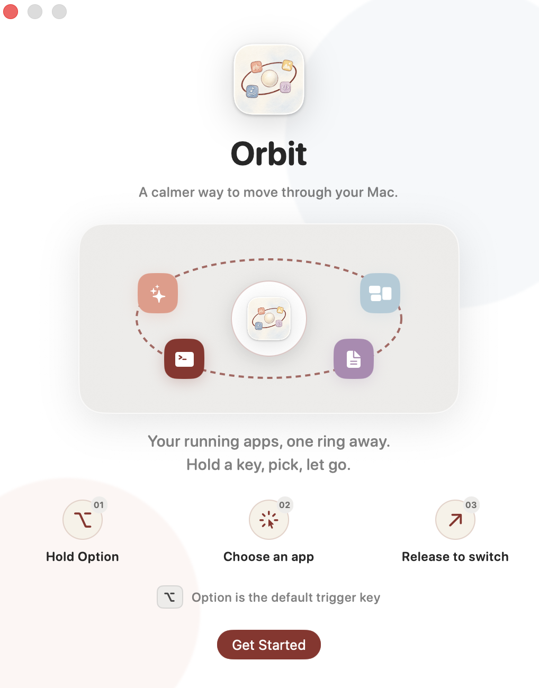
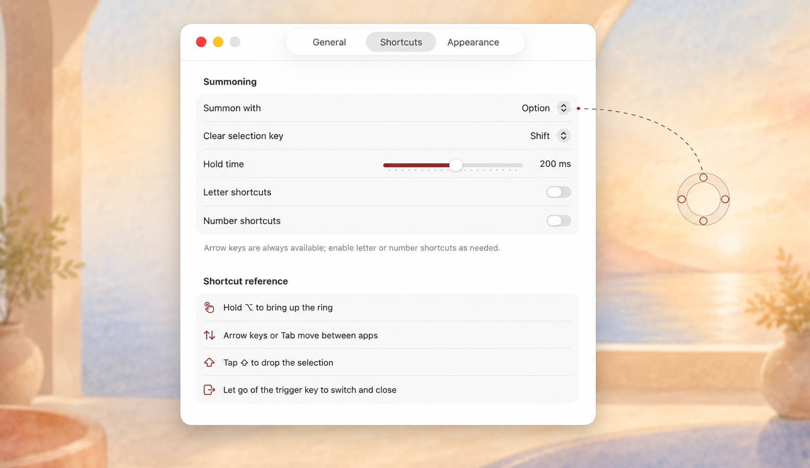
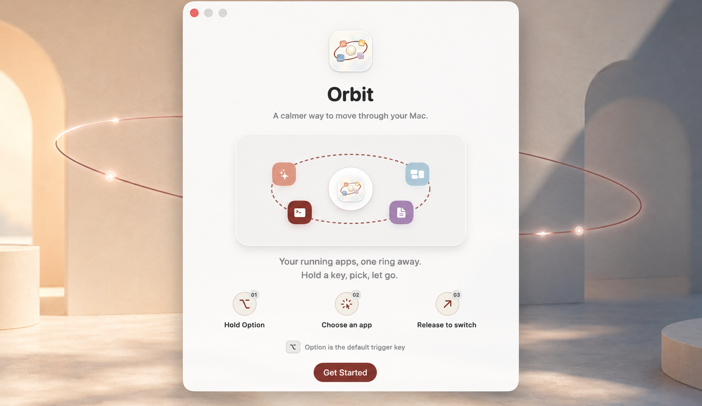
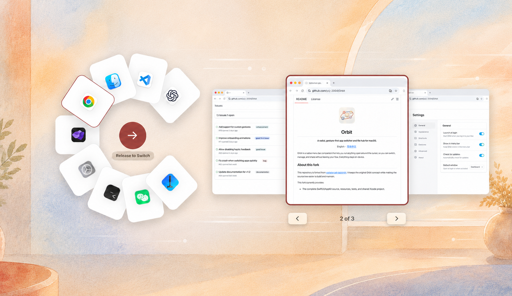

<p align="center">
  
</p>

<h1 align="center">Orbit</h1>

<p align="center">
  <strong>面向 macOS 的原生应用切换器，为想要更快切换窗口的人而做。</strong>
</p>

<p align="center">
  <a href="https://github.com/ycl-2004/Orbit/releases/latest"></a>
  <a href="https://github.com/ycl-2004/Orbit/releases"></a>
  
  
  <a href="LICENSE"></a>
</p>

<p align="center">
  <a href="https://github.com/ycl-2004/Orbit/releases/latest/download/Orbit-macOS.zip"><strong>⬇ 下载 macOS 版</strong></a>
  ·
  <a href="https://github.com/ycl-2004/Orbit/releases">版本发布</a>
  ·
  <a href="#功能">功能</a>
  ·
  <a href="#路线图">路线图</a>
  ·
  <a href="CONTRIBUTING.md">参与贡献</a>
  ·
  <a href="README.md">English</a>
</p>

<p align="center">
  
</p>

<p align="center">
  <sub>由 <code>photos/</code> 中的产品截图合成的功能巡览，之后会替换为真实录屏。</sub>
</p>

按住一个修饰键，正在运行的应用就环绕在鼠标周围。朝目标方向一甩、松手，切换完成。
不用扫列表，不用连按 Command-Tab，也不用满屏找窗口。Orbit 是一个用 SwiftUI 和
AppKit 写的菜单栏应用，没有任何第三方依赖，也不联网——所有处理都在本机完成。

## 快速开始

1. **[下载 `Orbit-macOS.zip`](https://github.com/ycl-2004/Orbit/releases/latest/download/Orbit-macOS.zip)** 并解压。需要 macOS 14.0 或更高版本。
2. 把 `Orbit.app` 移到 `/Applications`。首次启动请按住 Control 点按它并选择**打开**——这个构建是 ad-hoc 签名、未经 Apple 公证的，直接双击会被拦截。
3. 按提示授予**辅助功能（Accessibility）**权限，然后在任意界面长按 **Option（⌥）** 呼出环。

如果右键菜单里没有**打开**选项，手动清除隔离标记：

```bash
xattr -dr com.apple.quarantine /Applications/Orbit.app
open /Applications/Orbit.app
```

只有启用窗口预览时，Orbit 才会请求屏幕录制权限。

当前 Xcode 工程版本为 `1.3.0（build 2）`。已发布版本仍是 `v1.3.0`；源码中
尚未切出新 release 的改进统一记录在 [Unreleased](CHANGELOG.md) 中。

## 为什么用 Orbit

- **靠方位，不靠顺序。** 应用固定在鼠标周围的各个角度上，你记住的是方向，而不是"要按几下 Command-Tab"。
- **切到具体窗口，而不只是应用。** 开启预览后，松手前可以用左右方向键在选中应用的多个窗口里挑一个。
- **既跟手又稳定。** Orbit 根据最近激活历史决定环里显示哪些应用，然后可以在设置中选择按最近使用或按名称排列这些卡片。
- **中心就是拖放目标。** 把应用卡片拖进中心即可退出；可选的 Orbit 特殊卡片可以安全清理没有打开窗口的普通应用，Orbit 自己和 Finder 始终受到保护。把文件拖进去可以 AirDrop，长按则移入废纸篓。
- **数据不出本机。** 无账号、无埋点、无网络请求。纯原生 SwiftUI/AppKit，零第三方包。

## 功能

**切换**

- 长按修饰键呼出环形应用切换器，默认触发键为 Option（⌥）。
- 默认使用方向键导航；可在设置中按需启用字母和数字快捷键。
- 可选的环旁窗口预览：在设置中打开"显示窗口预览"，并授予屏幕录制权限；macOS 授权后需要重启 Orbit。
- **预选最近应用**默认关闭；打开后，呼出后直接松手的行为类似 Command-Tab。关闭时，没有明确选择就松手仍然是安全的无操作。
- 长按尚未完成时，如果先按了其他键、鼠标按钮或滚轮，Orbit 会取消这次待触发状态，避免误打开环。

**中心目标操作**

- 将应用拖到中心目标即可退出，并显示像素消散动画。
- 可在设置中显示 Orbit 特殊卡片；将它拖到中心会礼貌退出符合条件的无窗口应用，Orbit 自身和 Finder 永远不会被退出。
- 将文件拖到中心即可 AirDrop；持续停留后可改为移入废纸篓。

**个性化**

- 支持调整界面语言、最近使用/按名称排列、是否预选最近应用、预览大小（70%–150%）、触发键、取消选择键、字母/数字快捷键、长按阈值、环出现位置、卡片大小/材质和开机启动。
- 语言选择器包含 English、简体中文、繁體中文、日本語、한국어、Deutsch、Français、Русский、Dansk、Norsk bokmål 和 Esperanto。切换语言后会提示重启，让整个界面一致地重新加载。
- 预览会根据 Orbit 被呼出的目标显示器取图，多显示器或不同分辨率组合下也能保持清晰和稳定。

## 使用方式

- 长按触发键，在鼠标附近打开 Orbit。
- 悬停或点击卡片进行选择；松开触发键或按 Enter 确认。
- 按 Escape 取消。点击中心执行它当前显示的动作：没有选中应用时是取消，选中应用后是确认切换。
- 默认使用方向键（以及 Tab）导航应用；可在设置中启用数字键 `1`–`9` 或首字母匹配作为额外快捷键。
- 启用窗口预览且应用有多个窗口时，使用左/右方向键选择窗口；松开触发键或按 Enter 打开它。
- 按取消选择键（默认 Shift）清除高亮；随后松开触发键会关闭 Orbit 且不切换应用。
- 将应用卡片拖到中心并释放即可退出应用。
- Orbit 打开后，把文件拖到中心目标并立即松手会触发 AirDrop；在中心停留 0.9 秒，目标变成废纸篓后再松手，会把文件移入 macOS 废纸篓。文件处理完成前 Orbit 会保持打开。
- 点击菜单栏图标可以打开设置、权限页面或退出应用。

## App Intro / 欢迎介绍页

这张独立的 App Intro / Welcome 介绍图用一页说明 Orbit 的核心流程：按住
Option、选择应用、松手切换。它保留竖版构图，单独作为产品介绍视觉。

<p align="center">
  
</p>

## 截图

<details>
<summary>环形切换、文件操作、窗口预览与设置（共 8 张）</summary>

| Orbit 环 | 文件分享 | 文件删除 |
| --- | --- | --- |
|  |  |  |

| 退出应用 | 设置 | 欢迎页 |
| --- | --- | --- |
|  |  |  |

| 窗口预览 | 选择具体窗口 |
| --- | --- |
|  |  |

这些截图展示了当前 macOS 版本的 Orbit 功能流程。它们已经裁掉 macOS 菜单栏和桌面
外框，并统一为 1556×900，方便在文档中保持一致。真实 PNG 保存在 `photos/` 中，
README 与仓库内的产品截图保持同步。

</details>

## 路线图

以下只是方向，不是承诺；顺序和范围会随着实际反馈调整。想推动某一项，欢迎开
[issue](https://github.com/ycl-2004/Orbit/issues) 说明理由。

- [ ] 经 Apple 公证的签名构建，首次启动不再需要绕过步骤
- [ ] 通过 Homebrew Cask 分发
- [ ] 独立于最近使用集合的置顶应用
- [ ] 更多环形布局与外观选项
- [ ] 翻译校对与更多语言覆盖
- [ ] 全流程的键盘操作与无障碍支持

## 参与贡献

欢迎提 issue 和 PR——附上 macOS 版本与 Orbit 版本的 bug 报告是最有价值的贡献。

- 构建、测试与 PR 规范见 **[CONTRIBUTING.md](CONTRIBUTING.md)**。
- 第一次参与？可以从 **[good first issue](https://github.com/ycl-2004/Orbit/issues?q=is%3Aissue+is%3Aopen+label%3A%22good+first+issue%22)** 开始。
- 较大的改动请先开 issue 讨论。本仓库源码并非宽松开源许可，详见 [LICENSE](LICENSE)。

## 常见问题

<details>
<summary>macOS 提示"无法打开，因为无法验证开发者"</summary>

发布版是 ad-hoc 签名、未经 Apple 公证的，所以直接双击会被 Gatekeeper 拦截。
按住 Control 点按 `Orbit.app` 选择**打开**，或执行
`xattr -dr com.apple.quarantine /Applications/Orbit.app`。公证构建已列入
[路线图](#路线图)。

</details>

<details>
<summary>为什么需要辅助功能和屏幕录制权限？</summary>

**辅助功能**权限是全局修饰键触发所必需的——没有它，你在 Orbit 自身窗口之外按下
触发键时，macOS 不会通知 Orbit。**屏幕录制**权限只在你开启窗口预览时才请求，
因为实时窗口缩略图属于屏幕内容；macOS 要求授权后重启 Orbit 才生效。所有画面都
不会被保存或上传。

</details>

<details>
<summary>如何切换 Orbit 的界面语言？</summary>

点击菜单栏图标，进入**设置 → 语言**，选择**跟随系统**或 Orbit 自带的语言。
选择变化后 Orbit 会显示重启提示；重启后所有视图和菜单都会使用新的语言。

</details>

<details>
<summary>如何卸载 Orbit？</summary>

从菜单栏图标退出 Orbit，然后把 `/Applications/Orbit.app` 移到废纸篓。如果还想
清除偏好设置：

```bash
defaults delete app.orbit.local
```

权限可以在**系统设置 → 隐私与安全性 → 辅助功能 / 屏幕录制**中撤销。

</details>

<details>
<summary>Orbit 会联网吗？</summary>

不会。没有账号、没有统计分析、没有第三方依赖包。AirDrop 传输完全交由 macOS 处理，
不经过任何 Orbit 的服务器。

</details>

## 从源码构建

<details>
<summary>环境要求、构建与测试命令</summary>

环境要求：

- macOS 14.0 或更高版本（当前重建 Xcode 工程的部署目标）。
- Xcode 26 或更高版本。
- Accessibility 权限，用于全局修饰键触发。
- 如果启用实时窗口预览，还需要 Screen Recording 权限。

仓库的 **Code → Download ZIP** 下载的是源码树；"快速开始"中的链接则提供可直接
使用的 `.app`。你也可以使用 Xcode（或下面的命令）自行构建；若要在本机正常签名
或分发，请选择自己的 Team，并将本地 Bundle Identifier 改成你账号下的唯一值。
项目没有第三方依赖。

使用 Xcode 打开 `Orbit.xcodeproj`，选择 **My Mac**，然后点击 **Run**。
共享工程不会保存开发者 Team ID。如果 Xcode 要求签名，请选择你自己的 Team，
并把本地 bundle identifier 改成你账号下唯一的标识。

无需签名身份即可验证构建：

```bash
xcodebuild -project Orbit.xcodeproj -scheme Orbit -configuration Debug \
  -destination 'platform=macOS' -derivedDataPath .build/xcode \
  CODE_SIGNING_ALLOWED=NO build
```

运行包含单元测试和 UI 测试的完整测试套件：

```bash
xcodebuild -project Orbit.xcodeproj -scheme Orbit -configuration Debug \
  -destination 'platform=macOS' -derivedDataPath .build/xcode clean test \
  CODE_SIGNING_ALLOWED=NO CODE_SIGNING_REQUIRED=NO
```

只跑单元测试的快速循环：

```bash
xcodebuild -project Orbit.xcodeproj -scheme Orbit -configuration Debug \
  -destination 'platform=macOS' -derivedDataPath .build/xcode \
  CODE_SIGNING_ALLOWED=NO CODE_SIGNING_REQUIRED=NO test -only-testing:OrbitTests
```

仓库会排除构建产物、DerivedData、Xcode 用户状态、本地环境文件、密钥、日志和本地工作流状态。
源码、资源、测试、工程文件、workspace 数据和公开文档都会保留在 Git 中。

</details>

## 项目结构

- `Orbit/` — 应用源码、配置、资源和 asset catalog。
- `Orbit/Config/AppLanguage.swift` 与 `Orbit/Settings/` — 语言和用户偏好行为。
- `Orbit/Services/AppActivationHistory.swift` — 用于构建环形应用集合的最近激活历史。
- `OrbitTests/` — 交互与选择逻辑的单元测试。
- `OrbitUITests/` — UI 测试目标。
- `Orbit.xcodeproj/` — 共享 Xcode 工程和 workspace 数据。
- `photos/` — README 截图、演示动图和辅助图片。
- `scripts/` — 安装、发布打包与演示动图生成脚本。
- `docs/decisions/` — 产品与工程决策记录。

## 关于 Orbit

Orbit 是一个独立的原生 macOS 项目，围绕环形、手势优先的工作流打造。
本仓库包含：

- 完整的 SwiftUI/AppKit 源码、资源、测试和共享 Xcode 工程。
- 使用 `app.orbit.local` 作为可替换的 bundle identifier。
- 不包含开发者 Team ID、签名证书或机器专属的 Xcode 状态文件。
- 默认提供英文 README，并单独提供这份简体中文 README。
- 当前源码版本：`1.3.0（build 2）`。
- App 默认使用英文界面；应用内语言选择器提供 English、简体中文、繁體中文、日本語、한국어、Deutsch、Français、Русский、Dansk、Norsk bokmål 和 Esperanto。

## 许可证

编译后的 App 可供个人免费、非商业使用；源码按 [LICENSE](LICENSE) 中的条款
开放查看。

## 链接

- [下载最新版本](https://github.com/ycl-2004/Orbit/releases/latest)
- [Issues](https://github.com/ycl-2004/Orbit/issues)
- [贡献指南](CONTRIBUTING.md)
- [决策记录](docs/decisions)
- [English README](README.md)
